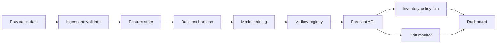

# Demand Signal Pipeline

[](https://github.com/<your-username>/demand-signal-pipeline/actions/workflows/ci.yml)

SKU-level demand forecasting on the M5 (Walmart) dataset, backtested against a seasonal-naive
baseline, served through a small API, and fed into a simplified inventory reorder-point simulation
with drift monitoring. Built to demonstrate the engineering discipline around a forecasting model —
tested, tracked, and honest about its own boundaries — rather than to imitate a full enterprise
supply-chain suite.

**Live demo:** _(added day 9 — API + dashboard link)_
**Status:** 🚧 day 1 of 10 — scaffold in place, no model trained yet.

## Why this exists

Most public demand-forecasting repos are a notebook and a claim. This one is trying to answer a
narrower, checkable question: does the model actually beat a trivial baseline, on every held-out
fold, and is that provable by anyone who clones the repo and runs `pytest`? See
[PROBLEM_STATEMENT.md](PROBLEM_STATEMENT.md) for exactly what "done" means here, defined before any
model was trained.

## Architecture



Full component breakdown, data zones, and non-goals: [docs/architecture.md](docs/architecture.md).

## Quickstart

**macOS / Linux:**
```bash
make setup            # creates .venv, installs the package + dev deps, installs pre-commit hooks
source .venv/bin/activate
make test
```

**Windows (PowerShell):**
```powershell
python -m venv .venv
.venv\Scripts\Activate.ps1
pip install --upgrade pip
pip install -e ".[dev]"
pre-commit install
pytest
```

Dataset setup (Kaggle CLI, one-time): see the "Data" section of
[docs/architecture.md](docs/architecture.md) once ingestion lands (day 2).

## Results

_(filled in day 5, once the model is trained — backtest table: model vs. seasonal-naive vs. ETS,
per fold, with the metric defined in PROBLEM_STATEMENT.md)_

## Decisions

Notable trade-offs are recorded as ADRs in [docs/decisions/](docs/decisions/), not just made
silently — e.g. [0001: gradient-boosted trees over deep learning](docs/decisions/0001-model-family.md).

## Limitations

- The inventory module ([src/dsp/inventory/](src/dsp/inventory/)) is a simplified reorder-point
  simulation, not a full MRP/DRP system. Lead times and service-level targets are illustrative
  constants, not sourced from a real supplier contract.
- Ingestion is batch, not streaming — a deliberate scope decision, not a limitation to fix later.
- Trained and backtested on a California/FOODS subset of M5, not the full dataset (see
  [PROBLEM_STATEMENT.md](PROBLEM_STATEMENT.md) for why).
- No auth/security hardening — this is a portfolio demo, not an internet-facing production service.

## Roadmap

Day-by-day build plan: see the project roadmap (linked from the pinned repo description).

## License

MIT — see [LICENSE](LICENSE).
