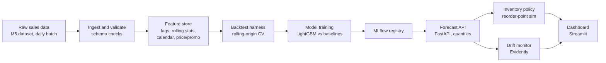

# Architecture

## Overview

Everything left of the registry (ingest → features → backtest → train → register) runs as a scheduled
Dagster batch job. The API, dashboard, and drift monitor are the only always-on pieces — that's
deliberate, since those are the only things that need to survive on a free-tier host.

## Data zones

| Zone | Contents | Format |
|---|---|---|
| `data/raw/` | M5 CSVs exactly as downloaded, never modified | CSV |
| `data/bronze/` | Validated, schema-checked, long-format sales | Parquet |
| `data/silver/` | Feature-engineered series (lags, rolling stats, calendar) | Parquet |
| `data/gold/` | Model-ready train/backtest folds + forecasts | Parquet |

All four are gitignored — the repo ships the *code that produces them*, not the data itself.
`docs/architecture.md` (this file) plus `PROBLEM_STATEMENT.md` are the source of truth for what
should be reproducible from a fresh clone + the Kaggle download.

## Component boundaries

- **`src/dsp/ingestion/`** — reads raw M5 CSVs, validates schema/ranges (pandera), writes bronze.
  Intentionally thin: this is not a general-purpose ingestion framework.
- **`src/dsp/features/`** — pure functions, each one unit-testable in isolation: lag features,
  rolling stats, calendar features, price/promo flags. Writes silver.
- **`src/dsp/models/`** — baselines (seasonal-naive, ETS), the LightGBM model, the rolling-origin
  backtest harness, MLflow logging/registry calls.
- **`src/dsp/api/`** — FastAPI app serving the registered model. Loads from the MLflow registry,
  not from a pickled file baked into the image, so a new model version doesn't require a rebuild.
- **`src/dsp/inventory/`** — the reorder-point simulation. Every assumption (lead time, service
  level target) is a named constant with a comment, not a magic number.
- **`src/dsp/monitoring/`** — Evidently-based drift/quality checks comparing recent predictions
  and features against a reference window.
- **`src/dsp/orchestration/`** — Dagster assets wiring the above into one scheduled graph.

## Deliberate non-goals

See PROBLEM_STATEMENT.md's "What's explicitly out of scope" — restated here because it's an
architecture decision, not just a modeling one: there is no message queue, no multi-region
deployment, and no Kubernetes. A single Docker Compose stack and one free-tier host are enough to
demonstrate the pattern, and adding infrastructure this project doesn't need would be the opposite
of the discipline it's trying to show.
